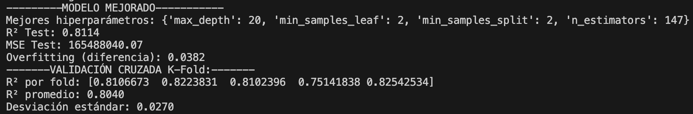
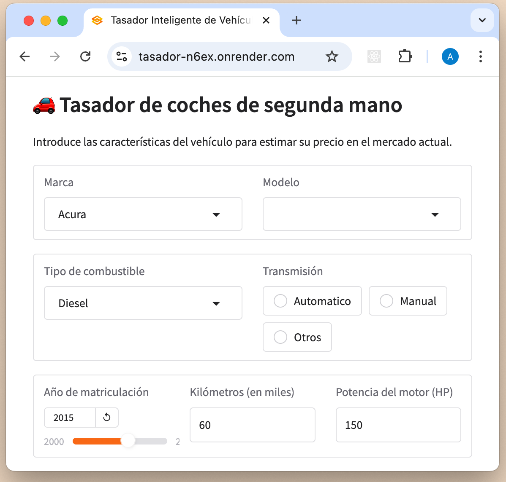
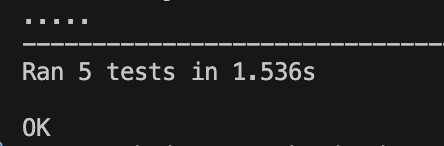

# Problema de Regresión - Poryecto V para FactoriaF5

### Realizado por el equipo 6:
#### [Anca Bacria](https://github.com/a-bac-0)
#### [Andreína Suescum](https://github.com/mariasuescum)
#### [Alla Haruntyunyan](https://github.com/alharuty)
#### [Mariela Adimari](https://github.com/marie-adi)
#### [César Mercado](https://github.com/merkandez)

Este proyecto tiene como objetivo construir un modelo de machine learning capaz de predecir el precio de venta de un vehículo en base a características como su antigüedad, kilometraje, potencia del motor, tipo de combustible, marca, modelo. Utiliza un enfoque de regresión con Random Forest y se ha optimizado mediante búsqueda aleatoria de hiperparámetros y validación cruzada.
Decidimos utilizar el [dataset](https://www.kaggle.com/competitions/playground-series-s4e9) ya sea para uso particular o profesional, el usuario podrá adivinar el precio de venta de coches de segundamano. 

Podrás descargar el repositorio:
```bash
git clone https://github.com/Factoria-F5-dev/ai-project-Regression.git
```

Crear y activar el entorno virtual en Mac:
```bash
python -m venv .venv
source .venv/bin/activate
```

Crear y activar el entorno virtual en Linux o Windows:
```bash
python -m venv .venv
venv\Scripts\activate
```

Instalar las dependencias necesarias:
```bash
pip install -r requirements.txt
```

Probar el modelo:
```bash
python tunning_model.py
```

## 📂 Estructura del Proyecto

```text
.
├── data/
│   ├── brand_enumeration.csv              # Codificación de marcas
│   ├── cleaned_dataset.csv                # Dataset limpio v1
│   ├── final_dataset.csv                  # Dataset limpio final
│   ├── used_cars.csv                      # Dataset original
│   ├── fuel_type_enumeration.csv          # Codificación tipo de combustible
│   ├── model_enumeration.csv              # Codificación de modelos
│   └── transmission_enumeration.csv       # Codificación de transmisión
├── gradio_app/
│   ├── config.py                          # Librerías de nuestras variables desplegables en el interfaz
│   ├── main.py                            # Función recoge los valores, prepara el dict,llama al modelo
│   ├── rf_best_prediction.py              # Carga el modelo desde el archivo .pkl
│   ├── utils.py                           # Diccionarios de codificación a partir de los _enumeration
├── images/
│   ├── config.py                          # Librerías de nuestras variables desplegables en el interfaz
├── models/                                # Carpeta con imágenes para la documentación
├── tests/
│   ├── model_tests.py                     # Script para tests unitarios
├── model.py                               # Script base de entrenamiento
├── README.md
└── requirements.txt                       # Dependencias del proyecto
├── tunning_model.py                       # Script final con ajuste de hiperparámetros, K-Fold y evaluación
├── used_cars.ipynb                        # Notebook de exploración, visualización y análisis de datos
```

## 🧾 Dataset
El conjunto de datos final contiene 4,000 registros y 9 columnas, todas numéricas y las categróricas convertidas a valores numéricos mediante **LabelEncoder**. Las columnas utilizadas como características (features) son:

- age: antigüedad del vehículo en años
- milage: kilometraje acumulado
- accident: accidente reportado o no
- engine_hp: potencia del motor en HP
- brand_id: marca del vehículo (codificado)
- model_id: modelo del vehículo (codificado)
- fuel_type_id: tipo de combustible (codificado)
- transmission_norm: tipo de transmisión (codificado) (Automático, Manual, Otros)

**Variable objetivo (target):**

- price: Precio de venta del vehículo en €.

## ⚙️ Modelado
El modelo principal utilizado fue un **Random Forest Regressor**, optimizado mediante **RandomizedSearchCV**. Se evaluaron varios hiperparámetros:

- n_estimators
- max_depth
- min_samples_split
- min_samples_leaf

Además, se aplicó **validación cruzada K-Fold** (5 folds) para medir estabilidad y capacidad de generalización.

## 📈 Resultados
- R² en conjunto de prueba: ~0.8114
- MSE en test: Aproximadamente 165488040
- Overfitting <5%: 0.0382
- R² promedio (K-Fold): 0.8040
- Desviación estándar K-Fold: 0.0270

El modelo generaliza bien y no muestra signos de sobreajuste ya que hemos ajustando la **profundidad de los árboles.**



## Principales librerías a usar:
- pandas
- numpy
- scikit-learn
- scipy
- joblib


## Interfaz gráfica con Gradio para uso personal o profesional
[Haz click aquí para visitar nuestra web en línea](https://tasador-n6ex.onrender.com)

Es una interfaz fácil e intuitiva hecho con Gradio y desplegado en render.com



Para ponerlo en marcha desde el terminal:
```bash
python gradio_app/main.py
```

Y en tu navegador ingresa:
```bash
http://0.0.0.0:8080
```
Y ya puedes utilizar el Tasador de coches de segundamano.

## 🧾 Test unitarios

Para garantizar la calidad y fiabilidad del modelo y el preprocesamiento de datos, hemos implementado pruebas unitarias utilizando la librería `unittest` de Python. Creamos 5 diferentes test para verificar que:
- Se pasan las variables (características) necesarios: age, milage, accident, engine_hp, brand_id, model_id, fuel_type_id, transmission_norm
- Existe la columna ‘price’
- La métrica R² es mayor que 0.70 y el modelo funciona de forma eficiente
- MSE sea menor que 170000000
- El modelo se guarda correctamente en la carpeta models

¿Cómo ejecutar las pruebas?

Ejecuta el script:
```bash
python -m unittest tests/model_tests.py
```

Esto ejecutará todas las pruebas unitarias definidas en el archivo `model_tests.py`.

**¿Qué pruebas se incluyen?**

- **Test de Preprocesamiento:** Verifica que los datos se carguen correctamente y se procesen sin errores.
- **Test de Métricas:** Asegura que las métricas como el **MSE** y el **R²** cumplan con los valores mínimos establecidos para garantizar que el modelo tenga un rendimiento aceptable.

**¿Por qué utilizar Unit Tests?**

Con estos tests podemos detectar errores en el proyecto y asegurar que los componentes del proyecto sigan funcionando correctamente cuando se realicen cambios o mejoras. 

Esto es especialmente útil en proyectos de Machine Learning, donde el preprocesamiento, la selección de características y el modelo pueden verse afectados por cambios en los datos o en el código.



 
## Versión Dockerizada

También hemos creado una imagen de Docker para que nuestro proyecto sea consistente, reproducible desde cualquier ordenador y sea fácil de compartir. 
Puedes poner en marcha el Tasador siguientdo los siguientes pasos:

Paso 1: Abre Docker Desktop en tu ordenador.

Paso 2: Descarga la [imagen](https://hub.docker.com/r/allaharuty/tasador) en tu terminal:
```bash
docker pull allaharuty/tasador:latest
```

Paso 3: Ejecuta la imagen:
```bash
docker run -p 8080:8080 allaharuty/tasador
```

Paso 4: Ve a tu navegador y pega:
```bash
0.0.0.0:8080/
```

ó 

```bash
localhost:8080/
```


## 👥 Trabajo en equipo

Para optimizar el rendimiento del equipo, adoptamos el modelo de trabajo Gitflow junto con GitHub y ramas de trabajo en local y remoto, y aplicamos la metodología Scrum. Desde el inicio del proyecto, definimos fechas límite claras para cada tarea asignada a los miembros del equipo. 

Durante el desarrollo, ajustamos dichas fechas según fuera necesario, manteniendo siempre el enfoque en la entrega de resultados dentro de los plazos establecidos.